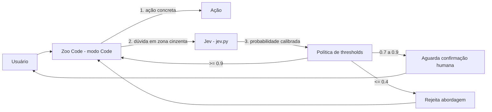

# AI Decision Layer

Camada de decisão tipada baseada em Jev, integrada ao Zoo Code para
evitar loops do agente. Este documento cataloga a motivação, a arquitetura,
os modos de falha da própria camada, e as lições extraídas da calibração
inicial.

Issue de origem: **Sprint 06 — infraestrutura de IA** (pré-requisito para
os Sprints 09-12: LLM + RAG + Agents + MCP).

## Contexto

O Zoo Code é o agente principal de geração de código do projeto. Ele opera
em modos (Code, Architect, Debug, Ask) e é excelente para escrever código,
mas tem um comportamento conhecido: quando um teste falha repetidamente, ele
tenta corrigir a **mesma linha** com variações cada vez menores, entrando em
loop. Isso foi observado em S06-00c (`auth.controller.ts` truncado) e em
S06-00d (race no `password-reset.spec.ts`).

A causa raiz do loop não é o modelo — é a **ausência de um critério objetivo
de parada**. O Zoo Code decide "a tarefa está concluída?" com a mesma
probabilidade subjetiva que ele decide "esta linha precisa de vírgula?".

A camada de decisão resolve isso separando as duas perguntas:

- **Geração de código** → Zoo Code (LLM generativo, caro, lento)
- **Decisão booleana** → Jev (modelo de decisão tipada, barato, ~100ms)

## Visão geral



O Jev **não gera texto** — retorna apenas uma probabilidade calibrada (para
`noul`), uma opção (para `choice`) ou um score (para `score`). Isso reduz o
custo de output a zero e a latência para 70-500ms.

## Como o Jev é chamado

```bash
python3 ~/.zcode/skills/jev/jev.py
```

Payload via stdin (JSON):

```json
{
  "state": "<evidência concreta: logs, tentativas, contexto do código>",
  "questions": {
    "<nome>": {
      "type": "noul | choice | score",
      "instructions": "<pergunta literal>"
    }
  }
}
```

Exemplos dos três tipos:

| Tipo | Uso | Retorno |
|------|-----|---------|
| `noul` | Sim/não com probabilidade | `0.0` a `1.0` |
| `choice` | Escolha entre opções | Nome da opção + confiança |
| `score` | Avaliação em escala | Número calibrado |

Múltiplas perguntas em uma única chamada são executadas em paralelo.

## Calibração inicial

Teste controlado com 4 variações do mesmo `state` para a pergunta "este
teste é flaky ou bug real?", usando `tests/e2e/users-edit.spec.ts` como
caso real.

| Cenário | `state` (resumo) | Resultado | Leitura |
|---------|------------------|-----------|---------|
| Sem contexto | `"teste"` | **0.56** | Chute (~moeda justa) |
| Contexto vago | `"falhou algumas vezes"` | **0.64** | Intuição fraca |
| Evidência forte de flake | 3/50, só em CI, passa local | **0.87** | Aposta alta |
| Evidência de bug real | `requireRole` + botão sumiu + mudança há 3 dias | **0.29** | Rejeição |

**Gap entre cenários opostos: 0.58.** Isso prova que o modelo responde à
evidência e não é um gerador de 0.5 que só chuta.

### Observações sobre o teto

O Jev **não cruza 0.9 nem com evidência forte** de flake (3 falhas em 50 =
6% de erro). Isso é calibração honesta, não bug. Consequência prática:
mesmo no melhor cenário, a política de thresholds ainda pede confirmação
humana — o que é o comportamento correto para decisões de `.skip()`.

### Custo

Todas as chamadas acima retornaram `cost: None` — confirmando uso do free
tier do OpenCode Zen. Uso de tokens: ~290-353 de input, ~21 de output por
chamada.

## Política de thresholds

Calibrada a partir dos dados acima, aplicada no modo Code do Zoo Code
(campo "Instruções personalizadas específicas do modo 💻 Code"):

| Faixa | Ação do Zoo Code |
|-------|------------------|
| **>= 0.9** | Prosseguir automaticamente |
| **0.7 – 0.9** | Mostrar resposta ao usuário e aguardar confirmação |
| **0.4 – 0.7** | Parar, pedir mais contexto (state insuficiente) |
| **<= 0.4** | Não executar. Reverter abordagem e reportar rejeição |

Os thresholds ficam **no modo Code**, não em arquivo versionado, para
manter uma única fonte de verdade. Este documento serve como referência
didática, não como configuração ativa.

## Modos de falha da camada de decisão

| Causa | Sintoma | Mitigação | Como validar |
|-------|---------|-----------|--------------|
| **`state` vago** (ex: `"teste"`) | Jev retorna ~0.5, decisão inútil | Instrução exige evidência concreta (logs, números, tentativas) no `state` | Rodar com `state` vazio e comparar com `state` rico (diferença esperada: ~0.3) |
| **Pergunta ambígua** (ex: "o que fazer?") | Jev não consegue responder (tipo `noul` exige binário) | Instrução exige pergunta literal e respondível com sim/não | Revisar a pergunta: se ela admite "depende" como resposta, está mal formulada |
| **Pergunta aritmética** ("quantas linhas faltam?") | Jev inventa número plausível mas errado | Instrução proíbe aritmética. Cálculo no código, resultado vai no `state` | Testar com soma conhecida (ex: 2+2) e verificar |
| **Chave de API ausente/inválida** | Script falha com erro de autenticação | Verificar `~/.jev/zen.key` e `ZEN_API_KEY` antes de rodar a skill | `ls -la ~/.jev/zen.key && wc -c ~/.jev/zen.key` (deve ser > 0) |
| **Threshold mal configurado** (ex: 0.5 auto) | Zoo Code prossegue com decisão ruim (0.6 em comando destrutivo) | Thresholds fixos em 0.9/0.7/0.4; comandos destrutivos exigem >= 0.9 | Testar com pergunta sobre `rm -rf` e verificar se Zoo Code pede confirmação |
| **Modelo retorna `noul` como `choice`** | Resposta em formato inesperado quebra o parser | Skill já valida o tipo de retorno; instrução não deve inventar tipos | Inspecionar output bruto: `noul` retorna número, `choice` retorna string |
| **Uso em decisões de alto risco sem revisão** | Agent executa ação irreversível baseado em 0.85 | Regra explícita: ações destrutivas exigem >= 0.9 **e** confirmação humana | Revisar logs do agente após execução |

### Recovery checklist

| Cenário | Recovery automático? | Como validar |
|---------|----------------------|--------------|
| Jev retorna 0.5 exato | Não — reescrever o `state` | Repetir com mais evidência, esperar >= 0.7 |
| Jev retorna erro de rede | Não — Zoo Code decide sozinho (fallback) | Simular desconexão, verificar que a ação ainda é pedida ao usuário |
| Jev contradiz o Zoo Code | Não — usuário é o juiz | Comparar os dois outputs, registrar no learning-log |
| Threshold dispara confirmação em excesso | Sim — ajustar caso a caso | Revisar faixa 0.7-0.9 se virar gargalo |

## Conexão com a trilha

Esta camada é o **embrião arquitetural** dos Sprints 09-12:

| Sprint | Tema | Conexão com a decisão tipada |
|--------|------|------------------------------|
| 09 | LLM + RAG | Jev é um LLM especializado em decisão; RAG futuro pode enriquecer o `state` com contexto do repo |
| 10 | Promptfoo + avaliação | Calibração por cenários (0.56/0.64/0.87/0.29) é exatamente o que Promptfoo automatiza |
| 11 | Agents + tools | O padrão "LLM decide, código executa" é a base dos agents |
| 12 | MCP + threat model | O Jev como "tool" registrada via MCP é o próximo passo natural |

## Lições

- **Modelo de decisão ≠ modelo generativo.** Jev não escreve código; responde
  uma pergunta calibrada. Misturar os dois é a fonte mais comum de loop.
- **O `state` é o teste.** Se o Jev responde ~0.5, o problema é a evidência,
  não o modelo. Escrever perguntas literais é 80% do trabalho.
- **Não terceirize aritmética.** Jev estima probabilidades, não conta.
  Calcule no código e passe o resultado como evidência.
- **Thresholds são política, não sugestão.** Se o modo Code pode "esquecer"
  o threshold, o loop volta. Por isso a regra vai no campo de instruções do
  modo, não no prompt do usuário.
- **Zona cinzenta é feature, não bug.** O `0.7-0.9` do Jev no caso flaky
  força uma pausa — e essa pausa é o momento em que o humano decide se vale
  investigar mais ou marcar como `.skip()`.

**Referências**:

- [`docs/architecture.md`](architecture.md) — visão geral do sistema
- [`docs/failure-modes.md`](failure-modes.md) — modos de falha do pipeline assíncrono
- [`docs/learning-log.md`](learning-log.md) — aprendizado do S06-00c/d sobre o Zoo Code
- Skill: `~/.zcode/skills/jev/` (não versionada — contém chave de API)
