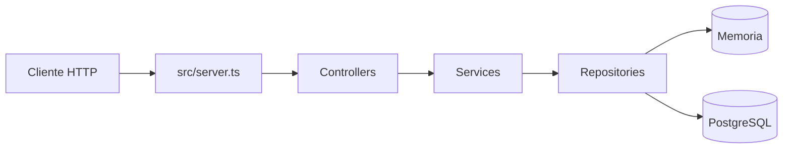

# Arquitetura

## Visao geral

A aplicacao e um servidor HTTP Node.js em TypeScript. O ponto de entrada em
`src/server.ts` cria as dependencias, registra o roteamento e inicia o servidor.
As regras de negocio nao dependem diretamente do transporte HTTP nem do banco
de dados.



## Responsabilidades

### Servidor e roteamento

`src/server.ts` e o composition root da aplicacao. Ele:

- carrega e valida `PORT` e `DATABASE_URL` em `src/config/env.ts`;
- cria o pool do PostgreSQL em `src/db/client.ts`;
- tenta conectar ao banco com retry no boot;
- executa as migrations versionadas antes de iniciar no Docker Compose;
- compoe controllers, services e repositories;
- interpreta metodo, caminho e corpo das requisicoes;
- encerra o servidor e o pool nos sinais `SIGINT` e `SIGTERM`.

O roteamento e intencionalmente pequeno e fica no servidor nesta fase do
projeto. Uma rota desconhecida retorna `404` com o formato de erro padronizado.

### Controllers

Os controllers traduzem a requisicao HTTP para uma chamada de servico e
transformam o resultado em status, headers e JSON. Eles nao armazenam regras
de negocio nem acessam repositories diretamente.

- `HealthController` responde ao health check.
- `UserController` atende listagem, busca, criacao, atualizacao e remocao de
  usuarios.

### Services

Os services concentram as regras de negocio e recebem dependencias por
injecao. `UserService` valida e normaliza dados, gera IDs, impede e-mails
duplicados e delega a persistencia ao contrato `UserRepository`.

`HealthService` converte o resultado tecnico do repository em um status de
saude da aplicacao: `ok` quando o banco responde e `degraded` quando a consulta
falha.

### Repositories

Os repositories isolam o acesso a dados por meio de portas/interfaces.

- `HealthRepository` executa `SELECT 1` no PostgreSQL.

O modulo `src/db/client.ts` tambem executa `SELECT 1` ate tres vezes durante o
boot. Se o banco permanecer indisponivel, o servidor inicia normalmente para
que o endpoint `/health` reporte o estado degradado.

- `PostgresUserRepository` implementa a persistencia de usuarios em PostgreSQL.
- `InMemoryUserRepository` implementa a persistencia temporaria usada nos testes.
- `UserRepository` define as operacoes necessarias pelo `UserService`.

O composition root usa `PostgresUserRepository` por padrao e permite selecionar
`InMemoryUserRepository` com `USER_REPOSITORY=memory` para testes HTTP isolados.
O `PostgresUserRepository` usa queries parametrizadas e mapeia a constraint
UNIQUE de email para `EMAIL_ALREADY_EXISTS`.

### Migrations

As migrations ficam em `migrations/` como pares `.up.sql` e `.down.sql`. O
runner `scripts/migrate.js` registra migrations aplicadas em `_migrations`,
executa cada arquivo dentro de uma transacao e permite aplicar, desfazer a
ultima ou criar uma nova migration.

### Domain

`src/domain/user.ts` define a entidade `User` e suas invariantes. A entidade
normaliza e-mail e nome, remove espacos externos e rejeita valores invalidos.
Isso mantém as regras fundamentais independentes do HTTP e da persistencia.

### HTTP errors

`src/http/error-response.ts` centraliza o formato:

```json
{
  "error": "not_found",
  "message": "Route not found"
}
```

As entradas invalidas retornam `400`, recursos ausentes retornam `404` e o
health check degradado retorna `503`.

## Fluxos principais

### Health check

1. A requisicao chega a `GET /health`.
2. `HealthController` chama `HealthService`.
3. `HealthService` chama `HealthRepository`.
4. `HealthRepository` executa `SELECT 1` no PostgreSQL.
5. O resultado vira `200`/`ok` ou `503`/`degraded`.

### Operacoes de usuarios

1. `src/server.ts` identifica `/users` ou `/users/:id`.
2. O controller valida o corpo quando necessario.
3. `UserService` aplica as regras de dominio.
4. `UserRepository` le ou altera o estado em memoria.
5. O controller serializa o resultado HTTP.

## Qualidade e testes

Os testes ficam próximos das implementacoes e usam Vitest:

- testes de dominio validam invariantes da entidade;
- testes de service usam repositories em memoria e mocks;
- testes de controller validam status e payloads sem abrir servidor;
- `src/server.integration.test.ts` valida o fluxo HTTP completo;
- o quality gate executa lint, typecheck, testes unitarios, integracao, build e
  cobertura.

A cobertura exige 80% de linhas, statements e funcoes, e 75% de branches.

## Decisoes relacionadas

A separacao em camadas foi registrada em
[`docs/adr/0001-arquitetura-em-camadas.md`](adr/0001-arquitetura-em-camadas.md).
