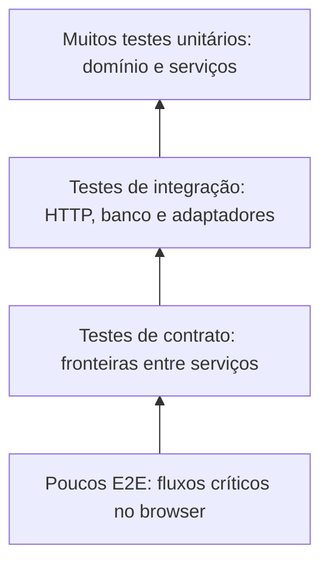

# Arquitetura de testes

A estratégia de testes segue uma pirâmide: muitos testes unitários rápidos,
um conjunto menor de testes de integração, testes de contrato quando o contrato
for introduzido e poucos testes E2E para validar fluxos críticos no navegador.



## Camadas

### Unitários

Testam uma unidade isolada, sem servidor, rede ou banco. São adequados para
regras de domínio e serviços, porque executam rapidamente e apontam a causa da
falha com precisão.

Exemplo em `tests/unit/services/user.service.test.ts`:

```ts
const repository = createRepository();
vi.mocked(repository.findByEmail).mockResolvedValue(undefined);
const service = new UserService(repository);

await expect(
  service.createUser({ email: "user@example.com", name: "Ada Lovelace" }),
).resolves.toMatchObject({ email: "user@example.com" });
```

### Integração

Validam a colaboração entre componentes reais, como servidor HTTP, controllers,
services e repositories. Podem usar o PostgreSQL de teste quando a variável
`RUN_DB_INTEGRATION=true` estiver habilitada; sem ela, a suíte usa o repository
em memória para validar o contrato HTTP sem depender do banco.

Exemplo em `tests/integration/server.integration.test.ts`:

```ts
const created = await userApi.create({
  email: "ada@example.com",
  name: "Ada Lovelace",
});
expect(created.status).toBe(201);

const found = await userApi.getById(created.body.id);
expect(found.body).toEqual(created.body);
```

### Contrato

**Conceitos**  
- **Consumer** – quem consome a API (ex.: um serviço que faz requisições HTTP).  
- **Provider** – quem implementa a API (nosso backend).  
- **Contrato** – descrição formal (via Pact) do request esperado pelo consumer e da resposta que o provider deve devolver.  
- **Verificação** – execução do *Provider verification* que roda o contrato contra o provider real.

**Quando usar**  
- Quando há **fronteira pública** entre serviços que evolui de forma independente.  
- Para garantir que alterações de rota, payload ou códigos de status não quebrem consumidores existentes.  
- Em pipelines CI para validar automaticamente contra alterações de código.

**Quando não usar**  
- Para **lógica interna** que não expõe API externa.  
- Quando a comunicação é estritamente síncrona dentro do mesmo processo (ex.: chamadas internas).  
- Se o custo de manutenção dos contracts supera o benefício (ex.: APIs muito voláteis com poucos consumidores).

**Como adicionar um novo contrato**  
1. Criar um diretório `tests/contract/` (já existente).  
2. Definir o *consumer* e *provider* no arquivo `tests/contract/pact.config.ts`.  
3. Escrever um teste consumer usando a API do Pact (`new PactV3(pactOptions)`) que descreve a requisição e a resposta esperada.  
4. Executar `npm run test:contract` para gerar o arquivo JSON em `pacts/`.  
5. Adicionar um teste de verificação do provider em `tests/contract/<nome>.provider.verify.ts` que inicia o servidor e chama `Verifier`.  
6. Incluir o script no CI (`npm run test:verify`) ou usar o Pact Broker.

**Trade‑offs**  
- **Benefícios**: detecção precoce de quebras de contrato, documentação viva da API, suporte a múltiplos consumidores.  
- **Custos**: manutenção dos arquivos de contrato, necessidade de manter o provider executável em CI, possível sobrecarga de tempo nos pipelines.

Exemplo conceitual de contrato para `POST /users`:

Exemplo conceitual de contrato para `POST /users`:

```ts
expect(response.status).toBe(201);
expect(response.body).toMatchObject({
  id: expect.any(String),
  email: "ada@example.com",
  name: "Ada Lovelace",
});
```

### E2E

Validam o fluxo completo no navegador, incluindo HTML, JavaScript, servidor e
persistência. Use `data-testid` estáveis para localizar controles sem acoplar o
teste a detalhes visuais.

Exemplo em `tests/e2e/users-create.spec.ts`:

```ts
await page.getByTestId("user-create-button").click();
await page.getByTestId("user-name").fill("João Silva");
await page.getByTestId("user-email").fill("joao@example.com");
await page.getByTestId("user-save").click();
await expect(page).toHaveURL("/users");
```

O Playwright está configurado em `playwright.config.ts` com relatório HTML,
`trace` na primeira tentativa de teste reexecutado e screenshot em falhas. Os
artefatos ficam em `playwright-report/` e `test-results/`.

Para abrir um trace:

```bash
npx playwright show-trace test-results/*/trace.zip
```

## Estrutura

```text
tests/
  e2e/          # Fluxos completos no navegador
  factories/    # Dados determinísticos reutilizáveis
  helpers/      # Clientes e utilitários de teste
  integration/  # HTTP, servidor e adaptadores
  setup/        # Banco e lifecycle dos testes
  unit/         # Domínio e serviços isolados
```

Os testes de produção ficam próximos das implementações quando isso ajuda a
manter a cobertura da unidade clara. A pasta `tests/` concentra cenários que
precisam de infraestrutura compartilhada ou atravessam mais de uma camada.

## Dados de teste

Prefira factories a objetos duplicados dentro dos testes. `UserFactory` cria
usuários determinísticos e aceita overrides parciais; `createMany` gera IDs
distintos para cenários de lote.

```ts
const user = UserFactory.create({ email: "grace@example.com" });
const users = UserFactory.createMany(3);
```

Builders são apropriados quando o objeto tem muitas combinações opcionais.
Fixtures devem ser reservadas para recursos compartilhados pelo lifecycle, como
configuração de banco e autenticação. Evite timestamps e aleatoriedade quando
não forem necessários para o comportamento testado.

## Isolamento

Cada teste deve poder executar sozinho e em qualquer ordem. Para integração com
PostgreSQL, `tests/setup/db.ts` usa `DATABASE_URL_TEST` e
`resetDatabase()` executa `TRUNCATE TABLE users RESTART IDENTITY CASCADE` antes
de cada cenário. O pool é encerrado em `afterAll` com `closeDatabase()`.

Na integração sem banco real, defina `USER_REPOSITORY=memory` e use uma porta
isolada para evitar interferência de processos locais. Testes E2E devem criar
recursos com dados únicos quando a suíte compartilhar um ambiente persistente.

## Clientes de teste

Use `tests/helpers/user-api-client.ts` para chamadas HTTP de usuários. O
`UserApiClient` centraliza a URL base, serialização JSON e leitura das respostas,
permitindo que os testes expressem a intenção sem repetir detalhes de `fetch`.

```ts
const userApi = new UserApiClient("http://127.0.0.1:3100");
const response = await userApi.delete("user-1");
expect(response.status).toBe(204);
```

## Como adicionar testes para uma feature

1. Identifique a regra principal e comece pelo teste unitário do domínio ou
   serviço.
2. Adicione um teste de integração se a mudança atravessar HTTP, banco ou um
   adaptador.
3. Atualize ou crie um teste de contrato quando o formato de uma fronteira
   pública mudar.
4. Adicione um E2E somente se o fluxo completo no navegador trouxer cobertura
   que as camadas inferiores não conseguem oferecer.
5. Use uma factory ou helper existente; crie um novo apenas quando reduzir
   duplicação real.
6. Execute o teste focado e depois a suíte da camada alterada.
7. Execute `npm run lint`, `npm run build` e os testes relevantes antes do
   commit.

Comandos principais:

```bash
npm run test:unit
npm run test:integration
npm run test:e2e
npm run lint
npm run build
```

## Trade-offs

Não escreva E2E para cada regra de negócio: eles são mais lentos, dependem de
browser e infraestrutura e geralmente produzem diagnósticos menos precisos.
Prefira unitários para regras, integração para colaboração entre módulos e
contratos para formatos públicos. Use E2E para poucos caminhos críticos, como
criar, editar, excluir usuário e autenticar.

Quando a integração real com PostgreSQL for o comportamento em risco, habilite
a suíte com `RUN_DB_INTEGRATION=true`; para validações HTTP rápidas, o
repository em memória reduz custo e dependências. Essa escolha deve aparecer
no nome ou na configuração do teste para que a diferença de cobertura fique
explícita.
